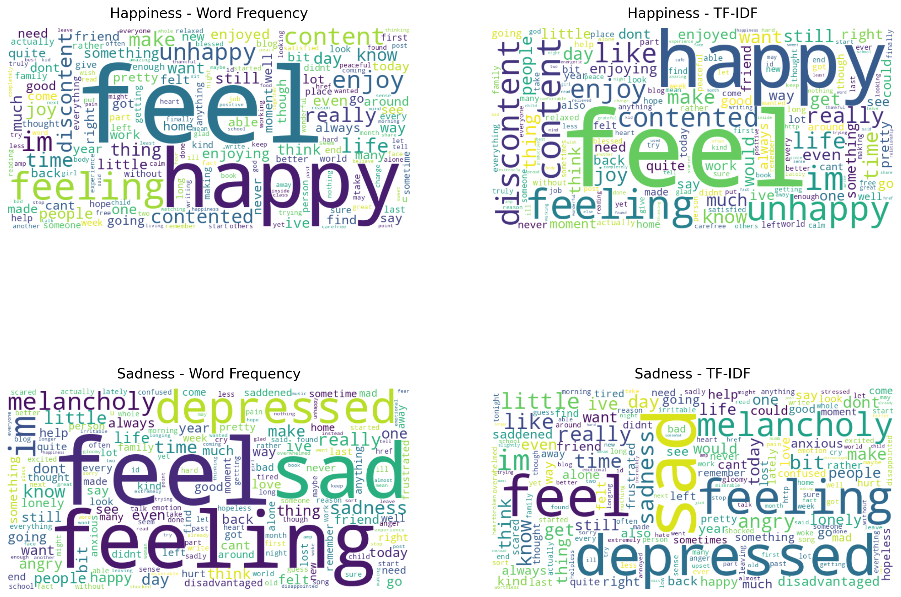

# NLP-Emotion-Classification-Research
Ongoing undergraduate NLP research exploring classification using TF-IDF and machine learning.
## Overview

This project is an undergraduate natural language processing (NLP) research project conducted through the GIRAFFE Undergraduate Research Workshop at Winston-Salem State University.

The research is being conducted collaboratively by Arianna Childs, Mackenzie Mann, and Dr. Kathleen Ryan.

The initial phase of the project focused on distinguishing between happiness and sadness in text using natural language processing and machine learning techniques. This phase was completed and presented as part of the GIRAFFE workshop.

The broader research project is ongoing, with plans to expand the analysis to additional emotions and continue exploring text preprocessing and classification techniques.

---

## Research Objectives

The project explores how natural language processing and machine learning can be used to identify emotions expressed in text.

The initial research focused on:

- Preparing and cleaning a large text-based emotion dataset
- Comparing text associated with happiness and sadness
- Transforming text into numerical features using TF-IDF
- Training a machine learning classifier to distinguish between happiness and sadness
- Evaluating classification performance using multiple metrics
- Exploring NLP preprocessing techniques and their effects on the data

---

## Dataset

The dataset used for this research contains more than 800,000 text records labeled by emotion.

The dataset was provided to participants through the GIRAFFE research program at Winston-Salem State University.

The full dataset is not included in this repository.

---

## Research Process

### Data Preprocessing

The text data was prepared for analysis using several preprocessing techniques, including:

- Converting text to lowercase
- Removing duplicate records
- Cleaning whitespace and punctuation
- Removing stop words
- Exploring stemming and lemmatization techniques

For the initial classification analysis, the dataset was narrowed to records representing happiness and sadness.

### TF-IDF

TF-IDF (Term Frequency-Inverse Document Frequency) was used to convert text into numerical features that could be processed by a machine learning model.

The resulting features were used to examine patterns within happiness and sadness text and as input for classification.

### Machine Learning

The processed text was divided into training and testing data and used to train a logistic regression classifier.

The model was evaluated on its ability to distinguish between happiness and sadness.

---

## Model Evaluation

Model performance was examined using several evaluation methods, including:

- Training and testing accuracy
- Confusion matrix
- Precision
- Recall
- F1 score
- ROC curve
- Area Under the Curve (AUC)

Using multiple evaluation metrics provided a more complete view of model performance than accuracy alone.

---

## Visualizations

### Word Frequency and TF-IDF Comparison

This visualization compares word importance using raw word frequency and TF-IDF. The comparison helps show how frequently occurring words differ from words identified as more informative by TF-IDF.

### Confusion Matrix

The confusion matrix shows the model's correct and incorrect classifications between happiness and sadness.

### ROC Curve

The ROC curve evaluates the classifier across different decision thresholds.

---

## Technologies and Methods

- Python
- Pandas
- Natural Language Processing (NLP)
- TF-IDF
- Logistic Regression
- Machine Learning
- Text preprocessing
- Data visualization
- Model evaluation

---

## Repository Contents

- `Emotions_Notebook.ipynb` — Main research notebook containing preprocessing, analysis, model training, and evaluation
- `nlp-images/` — Selected research visualizations and model evaluation figures
- `presentation/` — Research presentation materials (to be added)

The full research dataset is not included in the repository.

---

## Current Status and Future Work

The happiness-versus-sadness classification represents the first completed phase of this research.

Future work is intended to include:

- Expanding classification to additional emotion categories
- Continuing experimentation with text preprocessing techniques
- Further investigation of stemming and lemmatization
- Comparing how preprocessing choices affect classification performance
- Extending the current machine learning analysis

Because this is ongoing research, the repository will continue to be updated as additional stages of the project are completed.

---

## Research Presentation

The initial happiness-versus-sadness research was completed for the GIRAFFE Undergraduate Research Workshop.

A separate presentation focused on this research will be added following an upcoming research presentation at Lehigh University.

---

## Researchers

**Arianna Childs**  
DeSales University

**Mackenzie Mann**  
DeSales University

**Dr. Kathleen Ryan**  
Research Collaborator

---

## Acknowledgments

This research was conducted through the GIRAFFE Undergraduate Research Workshop at Winston-Salem State University.
